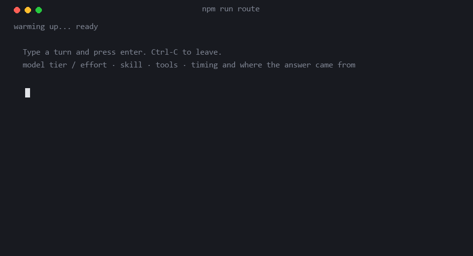

# jev-harness-router

**One fast call decides how an agent turn should run — then runs it.**

Before a harness spends a second on the real work, it has to answer four questions about
the turn in front of it. This asks all four in a single [Jev](https://docs.typesafe.ai/)
call, in about 350 ms, behind a deadline it is not allowed to miss.

| decision | how it is asked |
| --- | --- |
| **model tier** | not asked — derived in code from how hard the turn is and how much it touches |
| **effort budget** | same, from the same `Score` |
| **tools** | one `Noul` per tool, plus the tail of a ranking `Choice` |
| **skill** | one `Choice` over the catalogue, gated by four request-shape `Noul`s |



```ts
import { createRouter, defineCatalog } from "jev-harness-router";

const catalog = defineCatalog({
  models: [                                // cheapest first — the order is the ladder
    { tier: "fast", id: "claude-haiku-4-5", label: "Haiku", use: "Lookups, one-file edits." },
    { tier: "deep", id: "claude-opus-5",             label: "Opus",  use: "Design, cross-cutting work." },
  ],
  tools: {
    Read: { description: "Open a file the user named.", risk: "read" },
    Bash: { description: "Run a shell command.",        risk: "execute" },
  },
  skills: {
    debug: { description: "Work backwards from an error to its root cause." },
  },
});

const router = createRouter({ catalog });
await router.prewarm();                    // once, at startup

const route = await router.route({ message: "arreglá el bug de auth en el login" });

route.tier;    // "fast" | "deep"          — your names, not ours
route.model;   // "claude-opus-5"
route.effort;  // "low" | "medium" | "high" | "xhigh"
route.tools;   // ("Read" | "Bash")[]
route.skill;   // "debug" | null
route.source;  // "jev" | "cache" | "shortcut" | "fallback"
```

Against a keyword baseline on 181 labelled turns — 127 of them real, pulled from the
author's own Claude Code sessions — it picks the right skill **90.0%** of the time against
59.4%, and under-provisions the model on **3.3%** of turns against 19.9%. Full numbers, and
the one input that made them possible, are [below](#what-it-actually-does).

---

## Quick start

### As a dependency

```bash
npm install jev-harness-router
export TYPESAFE_API_KEY=…             # https://console.typesafe.ai/settings/keys
```

Describe your harness with `defineCatalog` as above and hand it to `createRouter`. The
router is the only thing that needs the key; running the routed turn is your harness's
job, on whatever provider it already talks to. `createRouter()` with no catalogue runs on
the shipped example — fine to try it, wrong to ship.

Set `HARNESS_ROUTER_DEADLINE_MS` in the environment to the value `npm run calibrate`
gives you from a clone, or pass `deadlineMs` explicitly. The shipped 600 ms was fitted
from one machine in Buenos Aires.

### The repo: CLIs, eval, bench

```bash
git clone https://github.com/JoacoMarc/jev-harness-router
cd jev-harness-router
npm install
cp .env.example .env
```

Put a [TypeSafe key](https://console.typesafe.ai/settings/keys) in `.env`. That is all the
router itself needs.

```bash
npm run calibrate     # measures your network, writes your deadline
npm run route         # type turns, watch them route
```

To also **run** the routed turn, add a provider key — Anthropic by default, see
[Provider](#1-provider--where-turns-run) to use something else:

```bash
npm run chat
```

No keys at all? `MOCK=1` answers from the local heuristic and says so on every line.

```bash
MOCK=1 npm run route
```

---

## Configuration

Everything that knows who you are is a **catalogue**: three plain objects — models,
tools, skills — plus an optional list of turns that need no model at all. Nothing else in
the package names a tool, a skill or a tier; the tests run the whole router on a
two-tier, two-tool catalogue in a different language to make sure of it.

The types flow from the catalogue. `defineCatalog({ ... })` keeps the literal names, so on
a router built from it `route.tier` is a union of *your* tiers and `route.skill` of *your*
skill ids, with no cast anywhere.

```ts
import { DEFAULT_THRESHOLDS, createRouter, defineCatalog } from "jev-harness-router";

const catalog = defineCatalog({
  models: [ /* 2. */ ],
  tools:  { /* 3. */ },
  skills: { /* 4. */ },
  shortcuts: { commandPrefix: /^\//, continuations: ["ok", "dale"] },   // 5.
});

const router = createRouter({ catalog, thresholds: { ...DEFAULT_THRESHOLDS, tierCuts: [2] } });
```

**In a clone**, the same three objects live in `src/catalog/` — `models.ts`, `tools.ts`,
`skills.ts`, `shortcuts.ts` — and `createRouter()` with no catalogue reads them. Edit
those to point the CLIs, the eval and the bench at your own harness. The fifth file,
`provider.ts`, is only consulted by `npm run chat`, which runs the turn.

### 1. Provider — where turns run

`src/catalog/provider.ts`

```ts
export const PROVIDER = {
  kind: "anthropic",              // "anthropic" | "openai"
  apiKeyEnv: "ANTHROPIC_API_KEY", // the variable name, never the key itself
  maxTokens: 4_096,
  effortParams: (effort) => ({ /* per-vendor reasoning knobs */ }),
} as const satisfies ProviderConfig;
```

Two wire formats reach almost everything. `kind: "openai"` plus a `baseURL` covers Groq,
Together, OpenRouter, DeepSeek, Mistral, vLLM, LM Studio and Ollama, because they all
speak the same chat-completions shape.

<details>
<summary><b>Copy-paste blocks for OpenAI, Groq, Ollama and friends</b></summary>

```ts
// OpenAI
export const PROVIDER = {
  kind: "openai",
  apiKeyEnv: "OPENAI_API_KEY",
  effortParams: (effort) => ({
    reasoning_effort: effort === "low" ? "low" : effort === "medium" ? "medium" : "high",
  }),
} as const satisfies ProviderConfig;

// Groq, Together, OpenRouter, DeepSeek, Mistral — same shape, different host
export const PROVIDER = {
  kind: "openai",
  baseURL: "https://api.groq.com/openai",
  apiKeyEnv: "GROQ_API_KEY",
} as const satisfies ProviderConfig;

// Ollama, LM Studio, vLLM — local, and the key is ignored
export const PROVIDER = {
  kind: "openai",
  baseURL: "http://localhost:11434",
  apiKeyEnv: "OLLAMA_API_KEY",
} as const satisfies ProviderConfig;
```

</details>

`effortParams` is the one place an effort level becomes vendor-specific: a thinking budget
on Anthropic, a named `reasoning_effort` on OpenAI, nothing at all on most local
endpoints. **Returning `{}` is a fine answer** — the routed model still changes, which is
most of the win.

### 2. Models — the capability ladder

`catalog.models` · in a clone, `src/catalog/models.ts`

```ts
models: [
  { tier: "fast",     id: "claude-haiku-4-5", label: "Haiku 4.5", use: "…", hints: [] },
  { tier: "balanced", id: "claude-sonnet-5",           label: "Sonnet 5",  use: "…", hints: [/…/] },
  { tier: "deep",     id: "claude-opus-5",             label: "Opus 5",    use: "…", hints: [/…/] },
],
```

**Order is the ladder**, cheapest first — policy escalates by index, so an entry's
position matters more than its name. Use two tiers or five; nothing is hardcoded to three,
but `DEFAULT_THRESHOLDS.tierCuts` has two cuts for a three-rung ladder — pass your own
with one cut per rung above the floor. `id` is whatever your provider calls it; nothing
parses it.

### 3. Tools — what the harness can offer

`catalog.tools` · in a clone, `src/catalog/tools.ts`

```ts
Bash: {
  description: "Run a shell command: build, test, install, inspect git history, or drive a CLI.",
  risk: "execute",        // "read" | "write" | "execute"
  hints: [/…/],
},
```

`risk` sets the bar a tool must clear to be enabled: `read` at 0.35, `write` at 0.6,
`execute` at 0.8. Override per tool with `threshold`. Descriptions say what kind of
request the tool serves, not what its API looks like — Jev matches on meaning.

**This is where safety lives.** The message driving the decision is untrusted input, and
Jev does not treat state as hostile by default, so the floor belongs in code rather than
in the model's answer.

### 4. Skills — the playbooks

`catalog.skills` · in a clone, `src/catalog/skills.ts`

```ts
"ita-commit": {
  description: "Commit staged work with a Conventional Commits message in the ITA format.",
  notFor: "Opening a pull request, which is ita-create-pr.",  // for confusable neighbours
  examples: ["commiteá esto", "hacé el commit de los cambios"],
  detail: "…",                                               // sent only on the optional 2nd hop
  hints: [/…/],
},
```

**Declaration order is the offline heuristic's precedence.** Jev does not care — a
Choice's criteria is a map — but the fallback takes the first card whose `hints` match, so
specific entries go above general ones: `docx-to-trello` sits above `trello-cli`,
`ita-review-code` above `code-review`.

A `Choice` accepts up to 255 options, and the docs recommend giving the model the full
list rather than a shortlist.

### 5. Shortcuts — turns that need no model at all

`catalog.shortcuts` · in a clone, `src/catalog/shortcuts.ts`

Bare acknowledgements in your users' languages, and your command prefix. These route in
**0 ms** with no call. The default catalogue ships Spanish and English; a catalogue that
declares none gets only the `/` command prefix.

### About `hints`

Every card can carry them: regexes used **only** by the offline heuristic, which is both
the fallback when the deadline passes and the baseline `npm run eval` scores against. Jev
never sees them — it reads `description`.

A card with no hints simply never fires there, which is a fine place to start. Patterns
match against diacritic-folded text, so write them unaccented: `arregl\w*` catches
"arreglá".

### The deadline

`npm run calibrate` times the round trip from where you actually are and writes
`HARNESS_ROUTER_DEADLINE_MS` into `.env`. It is the one number that cannot be inherited:
it is dominated by network distance to the API, and a bare TCP connect from Buenos Aires
is 217–360 ms depending on the hour.

```bash
npm run calibrate                      # 30 samples, targets 98% coverage
npm run calibrate -- --samples 60      # noisy network? sample longer
npm run calibrate -- --dry-run         # show the numbers, write nothing
npm run calibrate -- --ceiling 3000    # long turns can absorb a longer deadline
```

It applies a 1.25× margin and refuses to write anything past a 1500 ms ceiling without
telling you what that leaves to the heuristic. It earned that caution: an earlier version
sampled one lucky ten-second window, wrote 500 ms, and the next real turns fell back half
the time.

### Thresholds

`DEFAULT_THRESHOLDS` is fitted to **these** fixtures on **this** catalogue. Pass your own
to `createRouter({ thresholds })`; `npm run eval` sweeps every one of them and prints the
curves.

---

## What it actually does

Against `fixtures/turns.jsonl` — 181 labelled turns, 24 skills, 11 tools, 20 questions per
request — on `jev-1.13.0`. 54 of the turns were written for the router; 127 are real ones
from the author's Claude Code sessions, anonymised, 109 of them carrying the previous
assistant reply as `recentContext`, which is what a harness would hand the router:

| | keyword baseline | router | |
| --- | --- | --- | --- |
| skill exact | 59.4% | **90.0%** | +30.6pp |
| skill missed | 30.4% | **14.3%** | +16.1pp |
| skill false positive | 36.3% | **8.1%** | +28.2pp |
| tier too cheap | 19.9% | **3.3%** | +16.6pp |
| tier within 1 | 95.0% | 95.0% | ±0 |
| tier exact | 59.7% | **63.0%** | +3.3pp |
| tool recall | 60.6% | **69.1%** | +8.5pp |
| tool precision | 39.2% | **55.9%** | +16.7pp |

The regex baseline held up on the 54 turns written for it and fell apart on the real ones:
its skill hints fire on a third of turns where no skill applies. Read the tier rows together.
Both land within one tier 95% of the time; the baseline under-provisions on a fifth of
turns, the router on 3.3%. **Too big shows up on the bill. Too small shows up as a worse
answer nobody notices** — so the estimator is deliberately biased against it. Reading the
median instead (`difficultyQuantile: 0.5`) buys 68.0% exact for 6.1% too cheap; the sweep
is in `npm run eval`, pick your side.

Tool labels list only the tools a turn strictly cannot be done without, so a defensible
extra tool scores against precision, and the real turns leave `tools` unscored where the
context does not settle it.

Latency, across five benchmark runs on different days:

```
p50                 351–376ms      barely moves
p95                 444–1006ms     moves a lot
end to end, max     470–605ms      bounded by the deadline, by construction
fell back           0–8 of 50      0% to 16%, depending on the day
cost                4,015 input tokens per call    $0.169 per 1,000 turns
```

The single prettiest run is not quoted on its own, because it would mislead. The median is
stable and the tail is not, which is exactly the condition a deadline plus a fallback is
for: the router cannot make the network reliable, but it can stop an unreliable network
from reaching the turn.

---

## How it works

**One request per turn.** Every question is independent given the same state and Jev
evaluates them in parallel, so the router asks everything it might need and lets code
throw away what does not apply. Measured on this catalogue: one call with 20 questions is
2.5× cheaper and 24× faster than 20 calls with one each.

**It never asks "which model".** The tier is a property of the difficulty, which is a
property of the turn — asking directly is two hops of indirection, a documented weak spot
of `jev-1.13`. The router asks how hard the turn is and how much of the project it
touches; `policy.ts` maps that onto a model. Swapping a model is an edit to one catalogue
entry.

**Choice and Noul answer different questions, so both are used.** A `Choice` is relative
and always names a winner. A `Noul` is absolute and can come back low for everything. On
"escribí el ADR", `tool::Write` came back at **0.33** as a Noul — will the assistant *have
to* create a file? not necessarily, an ADR can go in the reply — and at **0.79** in the
ranking Choice, because *if* any tool is involved it is obviously that one. Both are
right, and the policy refuses to let the relative one clear the absolute bar on a
write-risk tool.

**The policy is pure.** `answers -> RouteDecision`, no I/O. The whole decision layer is
testable without a key, and a threshold moves without spending a request:

```bash
npm run eval -- --dump fixtures/answers.json    # once, against the API
npm run eval -- --replay fixtures/answers.json  # then sweep forever, for free
```

**The deadline is the contract.** No retries, raced against the router's own timer rather
than trusting the transport to honour an abort. Past it the heuristic answers — and that
heuristic is also the baseline the eval scores against, because a router that cannot beat
a page of regexes is not worth a network call.

### Where the decision goes

`prompt.ts` renders the skill choice as a block to **append after** your cached
system-prompt prefix, never spliced into it:

```ts
const { cached, suffix } = systemPromptParts(rosterText, route);
// mark `cached` with your cache breakpoint, then append `suffix`
```

This is the easiest way to lose more latency than the router saves. If the roster text is
not byte-identical every turn, the downstream model's prefix cache misses, and that miss
costs far more than the ~350 ms the router spent. `npm run chat` does this correctly and
reports how many tokens came back from cache, so you can watch it work.

The wording comes from the skill-suggestion cookbook, including the part that says the
suggestion may be ignored — pushing harder also wins compliance on the *wrong*
suggestions, and a wrong one is worse than none.

### Running it on the Claude Agent SDK

The [Claude Agent SDK](https://code.claude.com/docs/en/agent-sdk/overview) takes `model`,
`effort`, the tool set and a system-prompt suffix **per `query()` call** — the four things
the router decides. `toQueryOptions` maps one onto the other:

```ts
import { query } from "@anthropic-ai/claude-agent-sdk";
import { createRouter, toQueryOptions } from "jev-harness-router";

const route = await router.route({ message });
for await (const m of query({
  prompt: message,
  options: { ...toQueryOptions(route), cwd: process.cwd() },
})) { /* … */ }
```

`model` and `effort` go straight through. The routed tools become the SDK's `tools`, so the
turn's Claude Code has only those (`{ tools: "allow" }` uses `allowedTools` instead, and
`alwaysTools: ["Read"]` pins what must always exist). The skill block is appended to the
`claude_code` preset system prompt, after everything Claude Code puts there, so the cached
prefix is untouched. No runtime dependency on the SDK: the result is checked against the
SDK's `Options` type in the tests.

```bash
npm run example:agent-sdk -- "explicame qué hace src/router.ts"   # routes, then runs it, read-only
npm run savings                                                    # prices the model mix vs always-top-tier
```

`savings` routes the fixtures and prices the resulting mix with the list prices on the
model cards. It is a price mix under the assumption that every turn costs the same tokens
whichever model runs it — a cheaper model that needs more turns is not cheaper. Read the
Agent SDK's `modelUsage` on your own traffic before believing the percentage.

### What it deliberately does not do

**It does not execute tools.** The router decides which tools a turn should have, and
`chat` hands that decision to the model as context. Turning it into tool definitions and
an execute loop, with whatever sandboxing that needs, is the harness's job — and `Bash` is
in the default catalogue, so an example that ran model-chosen shell commands would be a
bad thing to ship.

So `chat` demonstrates three of the four decisions for real — model, effort, skill — and
reports the fourth. That is the honest boundary between a router and an agent.

---

## What the measurements changed

Seven things here are the way they are because a measurement said so, not because they
seemed right.

**Without `recentContext` the router is worse than the regexes.** Real turns are mostly
context-dependent — «si haz ambas», «deja el hook andando», «que pongo en cada uno». Routed
bare, Jev hit the exact tier on 34.6% of the 127 real turns against the heuristic's 69.3%,
and put 19% of them *two* tiers off: the difficulty question reads an unanswerable message
as "the shape of the work has to be figured out first", which is level 3, and the 0.60
quantile believes it. Handing it the previous assistant reply — about 600 characters — took
exact to 59.8% and off-by-two to 4%. The questions are the easy part; what you put in the
state is the router.

**Route on the distribution, not the expectation.** Asked how much work "escribí el ADR de
por qué elegimos Kafka sobre SQS" needs, Jev answered
`{0: 0.45, 1: 0.08, 2: 0.04, 3: 0.43}` — two readings of the turn, not one middling one.
Its expectation, 1.46, describes neither, and thresholding it sent a design task to the
cheapest model. Policy reads the 0.60 quantile instead, which took under-provisioning from
7.4% to 1.9%.

**A threshold sweep that will not peak means a question is missing.** The first eval could
only reach 90.7% skill accuracy, and only by dropping the gate to 0.10 — where it barely
gated. The cause: the cookbook's three gates all ask whether an *action* is wanted, and
this catalogue carries advisory skills. Writing an ADR touches nothing and follows no
command list, so `architecture` was suppressed on turns the ranking had named at
confidence 0.99. A fourth question about producing a structured work product restored a
real interior optimum (0.10 → 87.0%, **0.20 → 92.6%**, 0.30 → 90.7%, 0.40 → 79.6%).

**State size is not the lever here**, contrary to the usual advice. Ten times the tokens
changed the round trip by nothing — 306 tokens took 371 ms, 3,199 took 325 ms. The docs'
"filter the state first" guidance is measured against a 54 KB document; this router's
state is already tiny, and what is left is network. That is why it asks twenty questions
without flinching.

**A timeout must not abort the request.** Aborting on the deadline tears down the pooled
TLS connection, and re-establishing it costs about as much as the deadline itself — so a
slow turn made the next one slow, which timed out, which aborted. Live routes alternated
fallback/jev/fallback/jev indefinitely. The deadline is a timer now: the abandoned request
finishes on its own, the socket returns to the pool clean, and the late answer lands in
the cache so re-sending that turn is free.

**Warming the connection takes two calls, not one.** From a fresh process, request 1 takes
~885 ms, request 2 ~912 ms, and only from request 3 does it settle at ~350 ms. One warmup
left the first routed turn missing the deadline four times out of four.

**A constant computed at import is not configurable.** The deadline read its environment
variable at module scope, and ESM hoists every `import` above the module body — so it was
fixed before any CLI's `loadEnv()` ran, and `calibrate` wrote a value everything then
ignored.

---

## Commands

```bash
npm run route                            # decide only: interactive
npm run route -- "<turn>"                # one-shot
npm run chat                             # decide, then run it on the routed model
npm run chat -- "<turn>"

npm run calibrate                        # measure your network, write your deadline
npm run eval                             # accuracy vs the baseline, plus sweeps
npm run eval -- --fixtures <path>        # against your own labelled turns
npm run eval -- --replay <dump>          # re-sweep offline, zero API calls
npm run eval -- --strings                # A/B plain string skill criteria
npm run bench                            # percentiles, batching ablation, deadline curve
npm run savings                          # price the routed model mix vs always-top-tier
npm run example:agent-sdk -- "<turn>"     # route, then run it on the Claude Agent SDK (read-only)

npm test                                 # 113 tests, no key, no network
npm run typecheck
npm run lint
```

Flags worth knowing: `--rerank` enables the margin-gated second hop, `--deadline <ms>`
overrides the calibrated one, `--cold` skips prewarming, `MOCK=1` runs everything offline.

---

## Layout

```
src/catalog/types.ts     the card types, `defineCatalog` and the `Catalog` class
src/catalog/default.ts   the shipped example catalogue: models, tools, skills, shortcuts
src/catalog/provider.ts  where `npm run chat` runs the turn — the router never reads it
src/state.ts             the compact object Jev evaluates, with its truncation budget
src/questions.ts         every question, pure
src/policy.ts            answers -> decision, pure
src/heuristic.ts         the fallback, and the eval baseline
src/jev.ts               the only module that talks to TypeSafe
src/provider.ts          the only module that talks to the model provider
src/router.ts            shortcut -> cache -> jev(deadline) -> policy
src/prompt.ts            the block that goes after your cached prefix
bin/calibrate.ts         measures your round trip, writes your deadline
bin/chat.ts              routes a turn, then runs it
test/catalog.test.ts     the whole router on a catalogue that is not the shipped one
```

---

## What you cannot inherit

Three things here are empirical, and copying them across setups is how a router looks good
in a README and bad in production.

1. **The fixtures.** `fixtures/turns.jsonl` is 181 turns — 54 written for the router, 127
   taken from one person's real sessions — all labelled by that same person, in Spanish
   and English, against one team's skills. Replace them with real turns from your own
   harness, labelled with the route you actually wanted, and pass the previous reply as
   `recentContext` the way your harness would. This is the part that takes real effort and
   the part that makes everything downstream mean anything.
2. **The thresholds.** Fitted to those fixtures. Sweep them on yours. Watch for a sweep
   with no interior peak — that means a question is missing, not a number.
3. **The deadline.** `npm run calibrate`, and re-run it if you move or your network
   changes.

`npm run eval` compares against the heuristic every time. If your catalogue makes the
router worse than a page of regexes on some dimension, the table will say so. Believe it.

---

## Also worth knowing

- **Pin the model.** `.env.example` sets `jev-1.13.0`, not the `jev-latest` alias. Aliases
  move on release and these thresholds are calibrated against one version.
- **There is no server-side cache.** The `JsonCache` in the TypeSafe cookbooks is a local
  convenience for re-rendering docs. `src/cache.ts` is why a repeated turn is free here.
- **Context rot is still real**, even though state size is not this router's bottleneck.
  `state.ts` truncates hard and sends known facts as facts. Do not hand it the transcript.
- **The second hop is off by default.** Only 2–4% of turns have a contested enough ranking
  to want one, and it refuses to run when no finalist carries `detail` — re-reading the
  text that already ranked a skill is a round trip for nothing.

Node 22+. One runtime dependency: `@typesafe-ai/sdk`. MIT.
